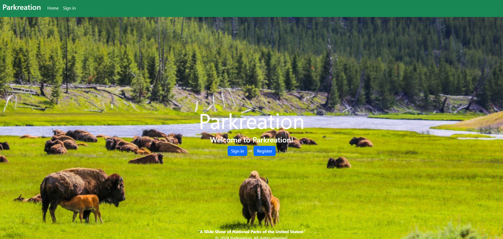
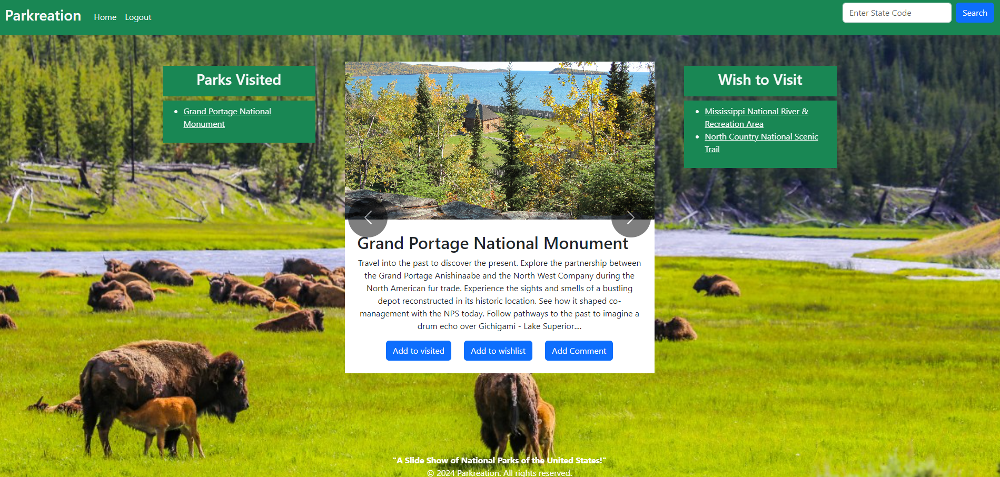
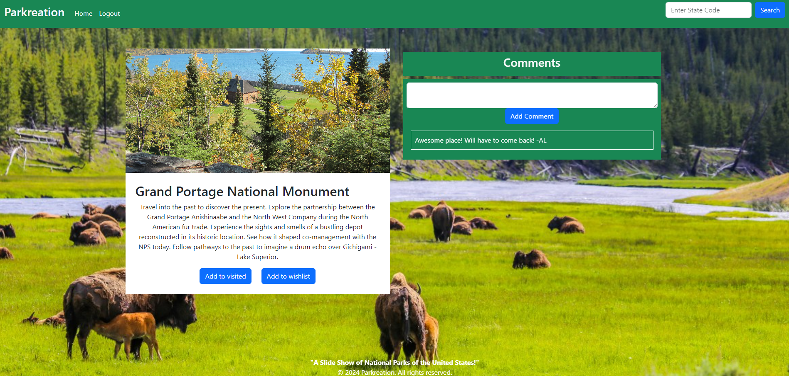

# Parkreation
National Park Message Board

> ## User Story/Acceptance Criteria
Users will register and later sign in on a landing page that has a background scenary

Users will be able to add parks to their visited/wish list

Users will be able to post comments about a national park

Users will be able to see a slide show of photos of national parks they visited or wish to visit

> ## Description
Parkreation is your ultimate companion for exploring national parks across the United States. Whether you're a seasoned traveler or a novice adventurer, Parkreation lets you discover, track, and share your national park experiences like never before.

> ## Installation
There are no installation steps for this application. Simply click the link deployed to Render, LINK. 
In order to install this program, you can clone the repository titled Parkreation on GitHub. Once you’ve cloned the repository into your local system, type “npm i” or “npm install” to install the required packages.

> ## Usage
Once you’ve entered the deployed application. You will be prompted to register an account. You will enter your email and password to create an account. Once logged in, you’ll be able to search for National Parks. You can add parks to your wishlist or already visited to track your progress!

> ## Screenshots
#### Homepage

#### Parks

#### Comments

> ## Credits
[Dia Jubara](https://github.com/djubara)

[Justin Holderman](https://github.com/JustindHolderman)

[Jackson Zellermayer](https://github.com/JacksonZellermayer)

[Dameine Yang](https://github.com/Dameine)

[Alex LaPierre](https://github.com/aslapi)

[National Park Service API](https://www.nps.gov/index.htm)
